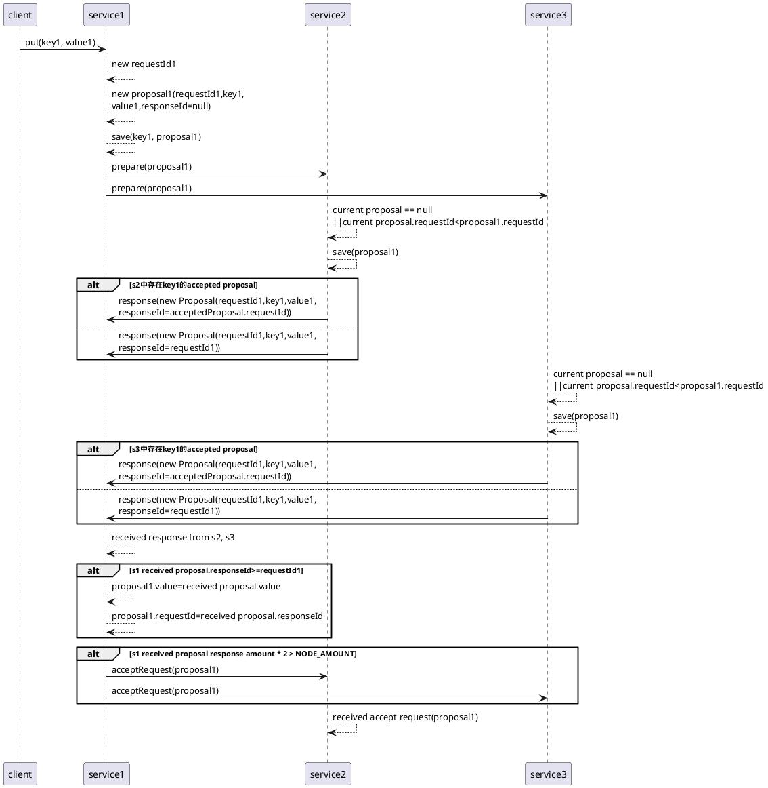

```plantuml
@startuml
participant client
participant service1 as s1
participant service2 as s2
participant service3 as s3

client -> s1: put(key1, value1)
s1 --> s1: new requestId1
s1 --> s1: new proposal1(requestId1,key1,\nvalue1,responseId=null)
s1 --> s1: save(key1, proposal1)
s1 -> s2: prepare(proposal1)
s1 -> s3: prepare(proposal1)

s2 --> s2: current proposal == null \n||current proposal.requestId<proposal1.requestId
s2 --> s2: save(proposal1)
alt s2中存在key1的accepted proposal
    s2 -> s1: response(new Proposal(requestId1,key1,value1,\nresponseId=acceptedProposal.requestId))
else
    s2 -> s1: response(new Proposal(requestId1,key1,value1,\nresponseId=requestId1))
end 

s3 --> s3: current proposal == null \n||current proposal.requestId<proposal1.requestId
s3 --> s3: save(proposal1)
alt s3中存在key1的accepted proposal
    s3 -> s1: response(new Proposal(requestId1,key1,value1,\nresponseId=acceptedProposal.requestId))
else
    s3 -> s1: response(new Proposal(requestId1,key1,value1,\nresponseId=requestId1))
end 

s1 --> s1: received response from s2, s3
alt s1 received proposal.responseId>=requestId1
s1 --> s1: proposal1.value=received proposal.value
s1 --> s1: proposal1.requestId=received proposal.responseId
end

alt s1 received proposal response amount * 2 > NODE_AMOUNT
s1 -> s2: acceptRequest(proposal1)
s1 -> s3: acceptRequest(proposal1)
end

s2 --> s2: received accept request(proposal1)
alt proposal1.requestId > 

@enduml
```